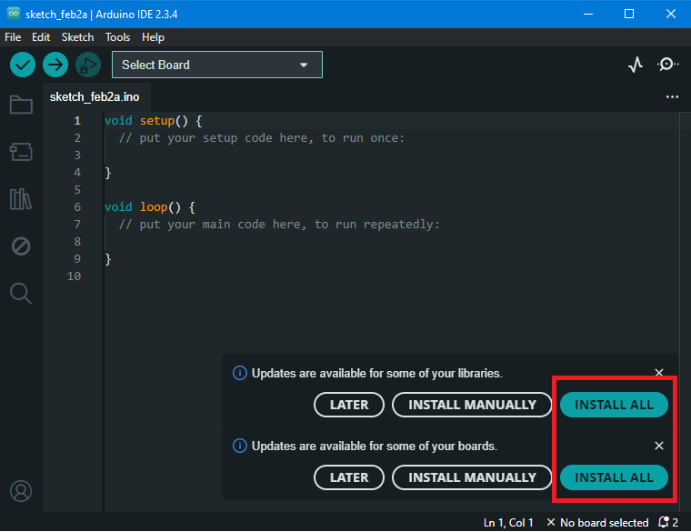
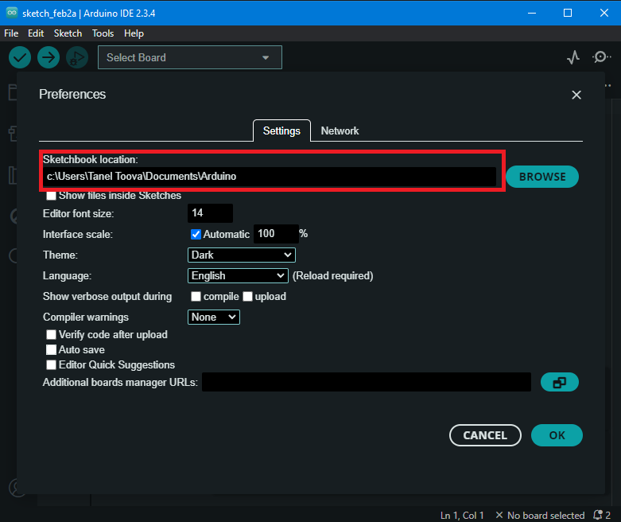
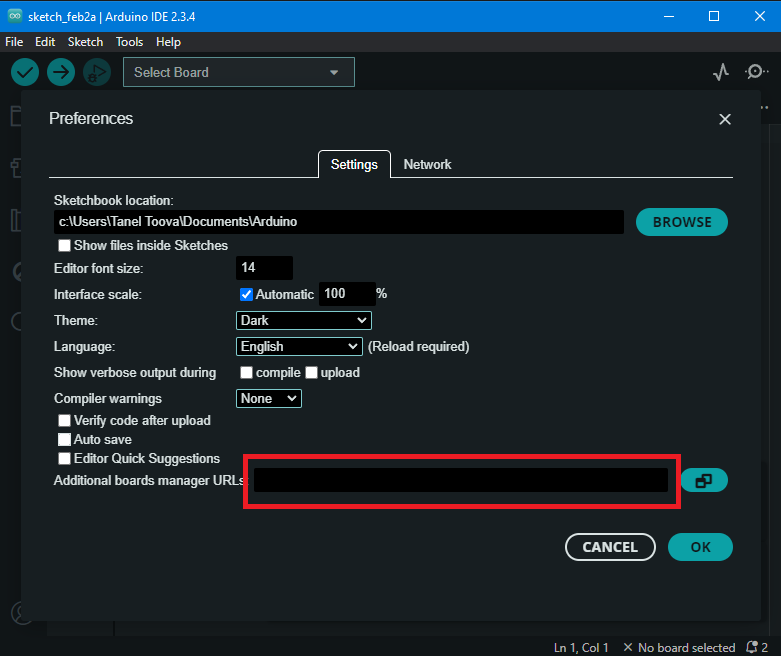

# Arduino IDE paigaldamine

Arduino IDE (Integrated Development Environment) on tarkvaraplatvorm, mida kasutatakse Arduino mikrokontrollerite programmeerimiseks. See pakub kasutajasõbralikku keskkonda, kus saab kirjutada, redigeerida ja üles laadida koodi otse Arduino arendusplaadile. Programmeerimiskeel põhineb C++ keelel ning IDE sisaldab suurt hulka valmisfunktsioone ja -teeke, mis lihtsustavad riistvaraga suhtlemist. 

1. Lae alla Arduino IDE viimane stabiilne versioon oma operatsioonisüsteemi jaoks:  [link allalaadimislehele](https://www.arduino.cc/en/Main/Software)

    

2. Paigalda allalaetud tarkvara

    Kui kasutad kolmanda osapoole poolt toodetud Arduino arendusplaati, siis lae alla CH340 kiibi draiver oma operatsioonisüsteemi jaoks: [link allalaadimislehele](https://sparks.gogo.co.nz/ch340.html)

    
    
    

3. Paigalda draiverid vastavalt allalaadmislehel olevatele juhenditele
4. Ava Arduino IDE tarkvara ja vajadusel paigalda uuendused

    

5. Määra kataloog, kuhu hakatakse vaikimisi salvestama sinu Arduino programme, mida nimetatakse "Sketchideks". Selleks ava "File -> Preferences" menüü ja täida "Sketchbook location:" väli.

    

6. Kui kasutad arendusplaadina mõnd _Arduino compatible_ arendusplaati (näiteks Adafuit Flora või NodeMCU), siis pead seadistama selle seadistuslingi. Selleks täida "Additional boards managers URLs" väli.

    
