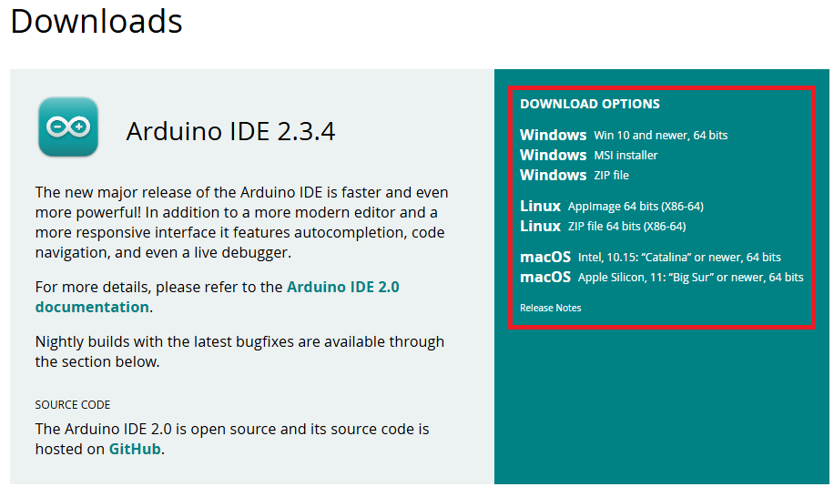
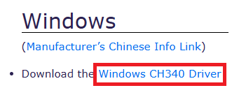
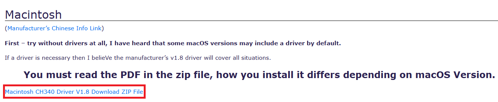
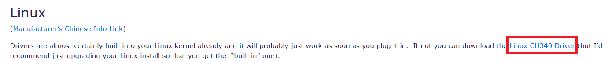

# Arduino IDE paigaldamine

1.  Lae alla Arduino IDE viimane stabiilne versioon oma operatsioonisüsteemi jaoks:  [link allalaadimislehele](https://www.arduino.cc/en/Main/Software) 
    
2. Paigalda allalaetud tarkvara
3. Kui kasutad kolmanda osapoole poolt toodetud Arduino arendusplaati, siis lae alla CH340 kiibi draiver oma operatsioonisüsteemi jaoks: [link allalaadimislehele](https://sparks.gogo.co.nz/ch340.html)
    
    
    