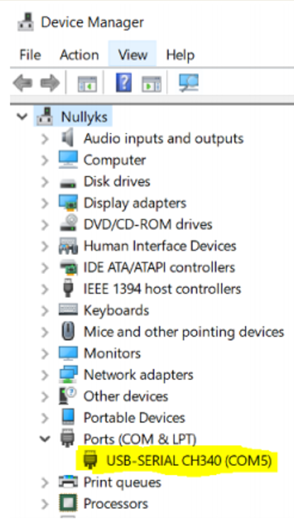
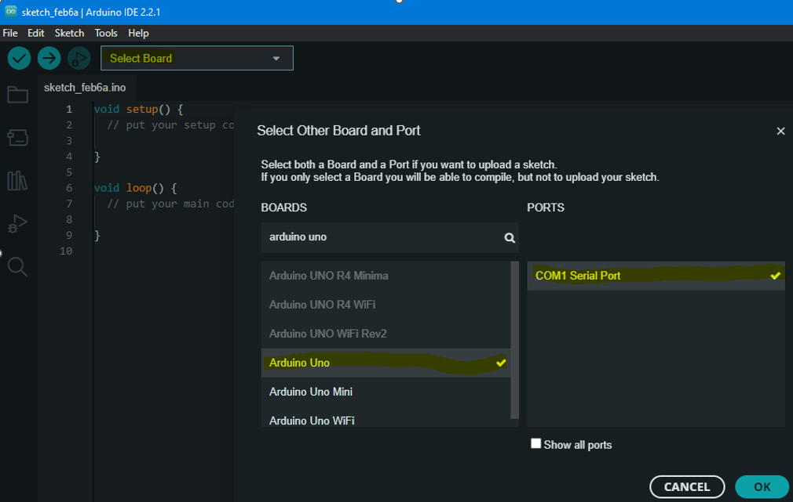
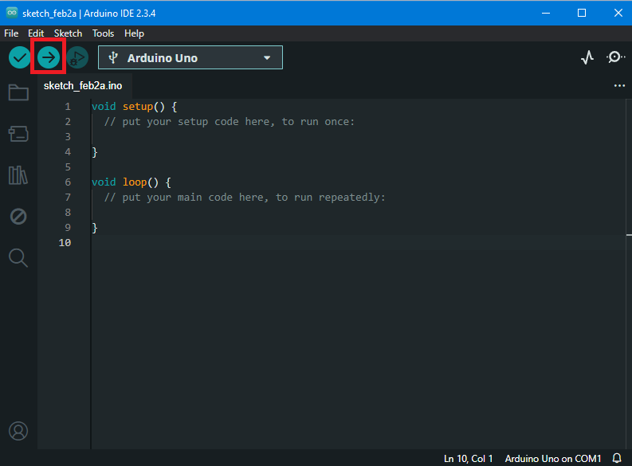

# Arduino arendusplaadi ühendamine arvutiga ja programmi üleslaadimine

1. Ühenda Arduino arendusplaat sobiva USB kaabli abil arvutiga.

2. Tee kindlaks kas ühendusplaat tunti ära ning millise pordi kaudu on see kättesaadav. 
    * Windowsi operatsioonisüsteemis ava Device Manager (paremklõps startmenüül -> Device Manager) ja otsi Ports alajaotuse alt CH340 või Arduino nimelist seadet. Jäta meelde COM pordi number.

        

    * Linux operatsioonisüsteemides on seadme nimeks kas "/dev/ttyACM*" või "/dev/ttyUSB*", kus * tähistab seadme järjekorranumbrit, mis algab numbrist 0. Kõigi selliste seadmete loetelu saab leida andes terminalis käsuks: ls /dev/tty\*
    * macOS operastioonisüsteemides on seadme nimeks kas "/dev/cu.usbmodem*" või "/dev/cu.usbserial-*", kus * tähistab pikemat numbrit. Kõigi selliste seadmete loetelu saab leida andes terminalis käsuks: ls /dev/cu.usb\*

3. Arduino IDE aknas vali "Select Board" ja määra sealt oma arendusplaadi mudel ja selle ühendusport

    

4. Ühenduse testimiseks laeme arendusplaadile tühja programmi vajutades "upload" ikooni. Kui avanenud Output paneelil ühtegi veateadet ei ole, siis üleslaadimine õnnestus.

    