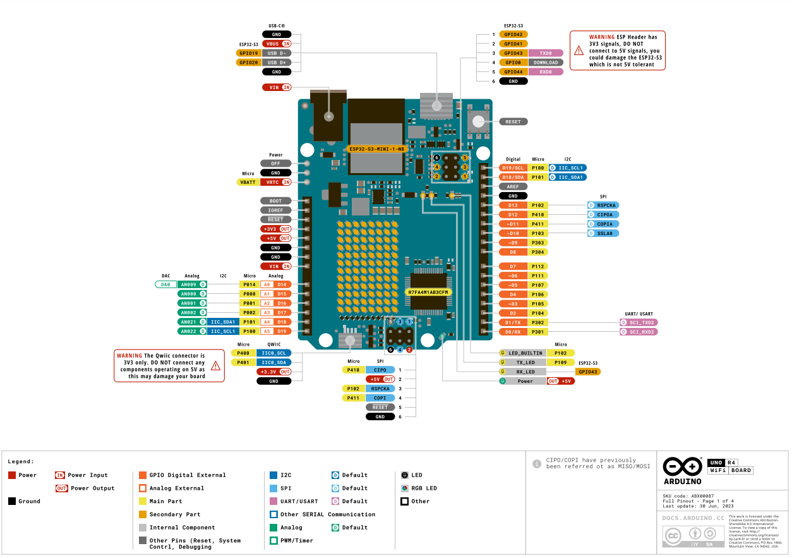

# Arduino UNO R4 arendusplaadi viigud

(Allikas: https://docs.arduino.cc/resources/pinouts/ABX00087-full-pinout.pdf)

Selleks, et Arduino arendusplaat saaks ümbritsevast keskkonnast informatsiooni koguda ja seda keskkonda kuidagi mõjutada, tuleb sellega ühendada andurid ja aktuaatorid. Need sisend- ja väljundseadmed suhtlevad arendusplaadiga viikude kaudu.
Arduino arendusplaatidel on palju erineva otstarbega ühendusviike ja see võib esialgu tunduda segadusttekitav. Alustamiseks piisab aga vaid mõnede viikude otstarbe tundmisest. 

Olulisemad viigud on:

* **Toiteviigud** +3.3V, +5V ja GND - Arduino UNO suudab pakkuda püsivat 3.3V või 5V pinget (voolutugevus ei tohiks ületada 450 mA). GND viik on maandus ja kõik GND viigud on samaväärsed. Toiteviike ei saa mõjutada oma programmiga.

* **Analoogviigud** A0 kuni A5 - need on sisendviigud andmete lugemiseks. Analoogviigud on ühendatud analoog-digital konverteriga (ADC), mis "tõlgib" viigule langeva pinge täisarvuks. Analoogviigud suudavad lugeda pinget vahemikus 0V-5V. Vaikimisi on Arduino UNO R4 ADC resolutsioon 10 bitti, mis tähendab, et tagastatakse täisarv vahemikus 0-1024. Maksimaalseks resolutsiooniks on 14 bitti, mis annab tagastusvahemikuks 0-16383. Analoogviigu väärtuse lugemiseks on funktsioon analogRead(). Näiteks viigu A0 väärtuse saame muutuja "andmed" sisse lugeda järgmiselt:
    ~~~cpp
    void setup(){
    }
    void loop(){
        int andmed = analogRead(A0);
    }
    ~~~
   **NB!** Analoogviike on võimalik kasutada digitaalviikudena.

* **digitaalviigud** 0 kuni 13 - neid viike saab kasutada nii väljund- kui sisendviikudena. Viigu kasutusrežiim tuleb deklareerida setup() funktsiooni sees. Digitaalviigud saavad olla pingega 0V või 5V. Kui digitaalviiku kasutatakse sisendviiguna, siis saab tema väärtust lugeda funktsiooniga digitalRead(), mis tagastab väärtuse 1 (HIGH) või 0 (LOW) vastavalt viigule langevale pingele. Näiteks viigu 2 väärtuse saame muutuja "andmed" sisse lugeda järgmiselt:
    ~~~cpp
    void setup(){
        pinMode(2, INPUT);
    }
    void loop(){
        int andmed = digitalRead(2);
    }
    ~~~
    Kui digitaalviiku kasutatakse väljundviiguna, siis saab tema väärtust määrata funktsiooniga digitalWrite(), väärtus saab olla 1 (HIGH) või 0 (LOW). Näiteks seame viigule 2 pinge 5V ehk väärtuse HIGH:

    ~~~cpp
    void setup(){
        pinMode(2, OUTPUT);
    }
    void loop(){
        digitalWrite(2, HIGH);
    }
    ~~~
    **NB!** digitaalviigud 0 ja 1 on kasutuses jadapordiühenduse jaoks ja seetõttu on mõistlik nende kasutamist vältida kui võimalik.

* **PWM võimekusega digitaalviigud** 3,5,6,9,10,11 - need viigud võimaldavad juhtida täiturite tööd (LED-i eredus, mootori kiirus jms.) lülitades signaali (meie näites 5V pinge) kiiresti sisse ja välja ning muutes sellega "sisse lülitatud" aja (impulsi pikkuse) ja "välja lülitatud" aja suhet. Seda suhet nimetatakse töötsükliks (duty cycle), mida väljendatakse protsentides. Näiteks LED-i puhul tähendab suurem töötsükkel eredamat valgust ja väiksem töötsükkel tuhmimat valgust. PWM võimekusega viigu töötsüklit saame määrata funktsiooniga analogWrite(). Töötsükli väärtus on määratav täisarvuga vahemikus 0 - 255. Näiteks määrame viigule 3 töötsükli 50%:
    ~~~cpp
    void setup(){
        pinMode(3, OUTPUT);
    }
    void loop(){
        analogWrite(3, 127);
    }
    ~~~

## Lisamaterjalid
[Arduino UNO R4 andmeleht](https://docs.arduino.cc/resources/datasheets/ABX00087-datasheet.pdf) - R4 on Arduino UNO uusim versioon, millel on mitmeid uuendusi. Märka kasvõi erinevusi digitaalsete viikude kasutamisel toiteallikana.

[Arduino UNO R3 andmeleht](https://docs.arduino.cc/resources/datasheets/A000066-datasheet.pdf) - R4 on Arduino UNO uusim versioon, kuid väga palju on kasutuses ka R3 versioonile vastavaid arendusplaate. Siin on selle versiooni andmeleht.