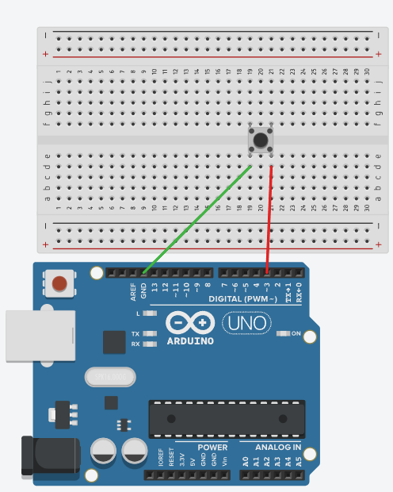
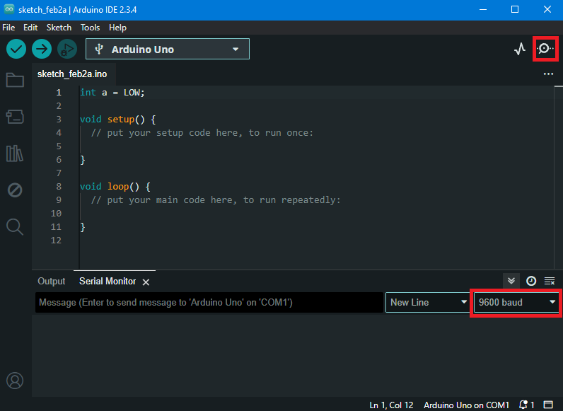

# Nupuvajutuse lugemine Arduino Uno arendusplaadiga

Seame endale eesmärgiks lugeda kokku mitu korda on kasutaja vajutanud Arduino Uno arendusplaadiga ühendatud nuppu ning kuvada tulemust üle jadapordi ühenduse.

Selle ülesande saab jagada alamülesanneteks, milleks on:

1. nupu ühendamine Arduino UNO-ga
2. nupuvajutuse sündmuse tuvastamine
3. nupuvajutuse kordade kokku lugemine
4. tulemuse edastamine üle jadapordiliidese

[Vaata lahendust Tinkercad keskkonnas](https://www.tinkercad.com/things/dHP2XfOs5vp-nupu-naide?sharecode=jzB2TWMdpPlzkOqoctD38mrp9T9ty2W0vcmSFo8u6xI)

## Nupu ühendamine
Nupul on kaks poolt, mis ei ole omavahel ühendatud, kui nuppu ei vajutata. Kui nuppu vajutatakse, siis sellel ajal on pooled ühendatud ja nende vahel saab liikuda elektrivool.
Kasutame ära Arduino UNO võimekust määrata digitaalse viigu (valime viigu 3) režiimiks INPUT_PULLUP. See tähendab, et viik ei ole mitte ainult sisend (mille väärtust me loeme), vaid et vaikimisi olekus on sellele langev pinge 5V (ühendattud Arduino siseselt läbi takisti). 
Ühendame viigu 3 nupu ühe poolega ja nupu teise poole ühendame GND viiguga. Kui nuppu vajutatakse, siis ühendab see viigud 3 ja GND (0V). Selle tulemusena muutub viigule 3 langev pinge 0V peale.

## Nupuvajutuse tuvastamine
Kui me loeme viigu 3 väärtust funktsiooniga digitalRead() sel ajal kui nuppu ei ole vajutatud, saame tulemuseks HIGH (5V). Aga kui loeme sel ajal kui nuppu vajutatakse saame tulemuseks LOW (0V). 
Seega kui me loeme piisavalt sagedasti viigu 3 väärtust, siis saame tuvastada kui see on 0V. Arduino programmi kohustuslik funktsioon loop() täidab kõiki selles olevaid käske n.ö. ringiratast - kui loop() lõppu jõuab algab ta lihtsalt otsast peale. 

Seega on väga tõenäoline, et kirjutades viigu 3 lugemise loop() funktsiooni sisse saame me nupu vajutuse sündmusele n.ö. pihta (Arduino UNO R3 suudab digitalRead() funktsiooni loop() funktsiooni sees käivitada umbes 200000 korda sekundis ja Arduino UNO R4 umbes 1000000 korda sekundis). See lähenemine ei tööta enam siis kui kasutame oma loop() funktsioonis pikki delay() käske või muid blokeerivaid funktsioone, mille täitmise ajal viigu 3 väärtust ei kontrollita. Loeme viigu 3 väärtuse ja tuvastame, kas see on LOW:
~~~cpp
    void setup(){
        pinMode(3, INPUT_PULLUP);
    }
    void loop(){
        int nupuOlek = digitalRead(3);
        if(nupuOlek==LOW){
           //nuppu vajutati 
        }
    }
~~~
## Nupuvajutuste kokkulugemine
Nüüd on meie edasiseks ülesandeks lugeda kokku nupuvajutuste arv. Selleks võtame kasutusele globaalse täisarvulise muutuja "vajutusi", mis toimib loendurina. Iga kord kui tuvastatakse nupuvajutuse sündmus suurendatakse selle muutuja väärtust ühe võrra. 

Kuna inimene on väga aeglane ja Arduino protsessor väga kiire, siis on oht, et ühte nupuvajutust loetakse mitu korda, sest inimene ei suuda piisavalt kiiresti nupust lahti lasta. Probleemi lahendamiseks peame Arduinot kunstlikult aeglasemaks tegema ja lisama peale loenduri suurendamist käsu delay(100), mis blokeerib Arduino 1/5 sekundiks. Meie programm on nüüd selline:
~~~cpp
    int vajutusi=0; // deklareerime muutuja ja väärtustame nulliga

    void setup(){
        pinMode(3, INPUT_PULLUP);
    }
    void loop(){
        int nupuOlek = digitalRead(3);
        if(nupuOlek==LOW){
           vajutusi=vajutusi+1; // tõstame loenduri väärtust 1 võrra
           delay(200); // blokeerime Arduino 200ms 
        }
    }
~~~

## Tulemuse edastamine üle jadapordiliidese
Kuna me tahame kasutajale teada anda, mitu korda ta nuppu vajutanud on, siis saame kasutada ära võimalust saata need andmed Arduinoga ühendatud arvutisse läbi jadapordi.  **NB!** See töötab ainult siis kui Arduino ja arvuti on USB kaabliga ühendatud.

Jadapordi ühenduse kasutamiseks peame deklareerima setup() funktsiooni sees ühenduse alustamise koos ühenduskiirusega. Selleks on olemas funktsioon Serial.begin(). Kui jadapordiühendus on alustatud, siis on võimalik saata andmeid kasutades funktsioone Serial.print() ja Serial.println() - neist esimene saadab andmed ilma realõpu sümbolita ja teine koos sellega. Meie kood näeb nüüd välja selline:
~~~cpp
    int vajutusi=0; // deklareerime muutuja ja väärtustame nulliga

    void setup(){
        pinMode(3, INPUT_PULLUP);
        Serial.begin(9600); //alustame jadapordi ühendust
    }
    void loop(){
        int nupuOlek = digitalRead(3);
        if(nupuOlek==LOW){
           vajutusi=vajutusi+1; // tõstame loenduri väärtust 1 võrra
           delay(100); // blokeerime Arduino 100ms
           Serial.print("Nupuvajutusi on: "); //tekst ilma realõputa
           Serial.println(vajutusi); //muutuja väärtus + realõpp
        }
    }
~~~

Arvuti poole peal oskab jadapordiühendust lugeda Arduino IDE tarkvara. Vastav paneel avaneb kui vajutada "Serial monitor" ikooni. Oluline on, et nii lugev kui saatev seade kasutaksid sama ühenduskiirust - baud rate.

## Lisamaterjalid
[Nupp pull-down takistiga ja olekumuutujaga](https://docs.arduino.cc/built-in-examples/digital/Button/) - meie näites lugesime nupuvajutust kui viigu pinge muutus 5V -> 0V. Aga saab ka vastupidi. Samuti kasutatakse selles näites nupu oleku määramiseks muutuajat, mis mõnikord on ka kasulik lahendus.

[Jadapordiühenduse selgitus koos kõigi funktsioonidega](https://docs.arduino.cc/language-reference/en/functions/communication/serial/) - meie näites kasutasime jadapordiühendust väga lihtsal viisil. Tegelikult on sellega võimalik palju rohkem teha. Siin on asjakohane dokumentatsioon iseseisvalt edasi uurimiseks.