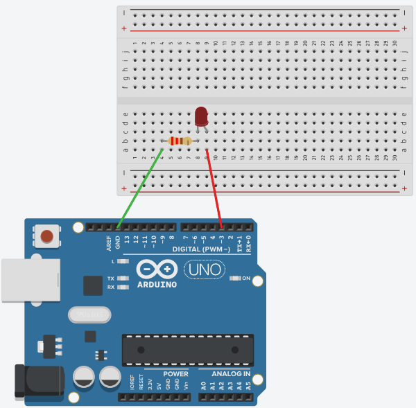

# LED-i juhtimine

Seame endale eesmärgiks vilgutada LED-i kõigepalt 5 korda sisse ja välja ning seejärel panna LED kiirgama valgust 33%, 66% ja 100% heledusega.

Selle ülesande saab jagada alamülesanneteks, milleks on:
* LED-i ühendamine Arduino UNO-ga
* LED-i vilgutamine lülitades seda sisse ja välja
* LED-i heleduse kontrollimine pikkusmodulatsiooni (PWM abil)

[Vaata lahendust Tinkercad keskkonnas](https://www.tinkercad.com/things/aUQMRRQp4VC-led-i-naide?sharecode=A0VPoYtYasrdUSRN4kEtaZbjpWbUwGX7AnCLGtIL6Ms)

## LED-i ühendamine
LED on diood, mis kiirgab valgust, kui seda läbib elektrivool. Kuna tegemist on dioodiga, siis läbib elektrivool seda vaid ühes suunas - anoodilt katoodile. Tavalise 5mm LEDi puhul on anoodiks pikem elektrood ja katoodiks lühem elektrood.

Kui dioodi läbib piisava pingega vool, siis muutub dioodi enda siseminetakistus väga väikeseks. Seetõttu on tarvis dioodiga jadamisi ühendada püsitakisti, mis piirab vooluahelas voolutugevust, et see dioodi läbi ei põletaks. Tavalise 5mm LED-i puhul on sobivaks 220 Ohm nimitakistusega takisti.

Kuna meie eesmärk on LED-i kontrollida, siis peame valima voouallikaks sellise viigu, mida saame oma programmis mõjutada. Selleks sobib väga hästi digitaalviik 3, mis on muuhulgas ka PWM võimekusega. Et vooahel töötaks tuleb selle teine ots ühendada GND viiguga.

## LED-i vilgutamine
Kuna oleme vooluallikaks valinud viigu 3, siis tuleb see deklareerida väljundviiguna - OUTPUT. Selleks kasutame funktsiooni pinMode(). 

Kuna me tahame oma LED-iga teha erinevaid asju (vilgutada ja muuda heledust), siis deklareerime iga tegevuse jaoks oma funktsiooni, mida kutsume eraldi välja. Vilgutamiseks deklareerime funktsiooni vilguta(). Selle funktsiooni sees muudame viigu 3 pinget digitalWrite() funktsiooniga vastavalt 5V ja 0V peale - lülitame LED-i sisse ja välja. 

Selleks, et ka inimene muutust näeks peab LED mõnda aega olema nii sisselülitatud kui väljalülitatud. Kasutame delay() funktsiooni arendusplaadi protsessori ajutiseks blokeerimiseks.
Saame järgneva koodinäite:
~~~cpp
void setup(){
        pinMode(3, OUTPUT); // viik 3 on väljund
    }
    void loop(){
        vilguta(5); // kutsume välja funktsiooni vilguta parameetriga 5
    }

void vilguta(int kordi){ //funktsioon ei tagasta midagi ja nõuab ühte täisarvulist parameetrit
    while(kordi>0){ //tsükkel kestab kuni kordade arv on suurem kui 0
        digitalWrite(3,HIGH); // viigu 3 peale pinge 5V
        delay(500); //ootame 1/2 sekundit
        digitalWrite(3,LOW); //viigu 3 peale pinge 0V
        delay(500); //ootame 1/2 sekundit
        kordi=kordi-1; //vähendame kordade arvu 1 võrra
    }
}
~~~
## LED-i heleduse muutmine
LED-i heledust saame kontrollida pikkusmodulatsiooni abil kasutades analogWrite() funktsiooni. Kuna meie eesmärk oli muuta heledust kolm korda, siis deklareerime ka selle tegevuse jaoks omaette funktsiooni muudaHeledust(). Lisades selle juba olemasolevale koodile saame järgneva tulemuse:

~~~cpp
void setup(){
        pinMode(3, OUTPUT); // viik 3 on väljund
    }
    void loop(){
        vilguta(5); // kutsume välja funktsiooni vilguta parameetriga 5
        muudaHeledust(); // kutsume välja funktsiooni muudaHeledust ilma parameetriteta
    }

void vilguta(int kordi){ //funktsioon ei tagasta midagi ja nõuab ühte täisarvulist parameetrit
    while(kordi>0){ //tsükkel kestab kuni kordade arv on suurem kui 0
        digitalWrite(3,HIGH); // viigu 3 peale pinge 5V
        delay(500); //ootame 1/2 sekundit
        digitalWrite(3,LOW); //viigu 3 peale pinge 0V
        delay(500); //ootame 1/2 sekundit
        kordi=kordi-1; //vähendame kordade arvu 1 võrra
    }
}
void muudaHeledust(){
    analogWrite(3,85); // 85 on umbes 33% 255-st
    delay(1000);
    analogWrite(3,169);// 169 on umbes 66% 255-st
    delay(1000);
    analogWrite(3,255);// 255 on 100% 255-st
    delay(1000);
}
~~~

## Lisamaterjalid
[LED-i vilgutamine ilma delay() funktsioonita](https://docs.arduino.cc/built-in-examples/digital/BlinkWithoutDelay/) - meie näites blokeerisime LED-i vilgutamiseks ajutiselt Arduino töö. Mõnikord on aga tarvis sel ajal hoopis midagi teha, mitte oodata. Lingil on näide, kuidas seda teha.

[Funktsioonide kasutamisest Arduino programmides](https://docs.arduino.cc/learn/programming/functions/) - veidi pikem sselgitus oma funktsioonide tegemise kohta.